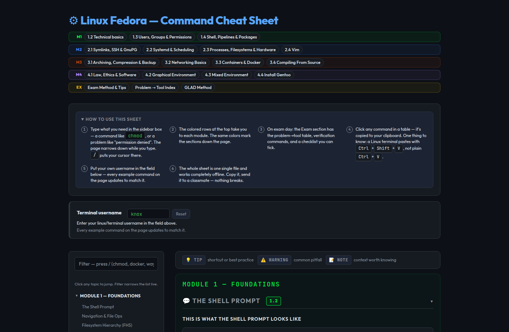
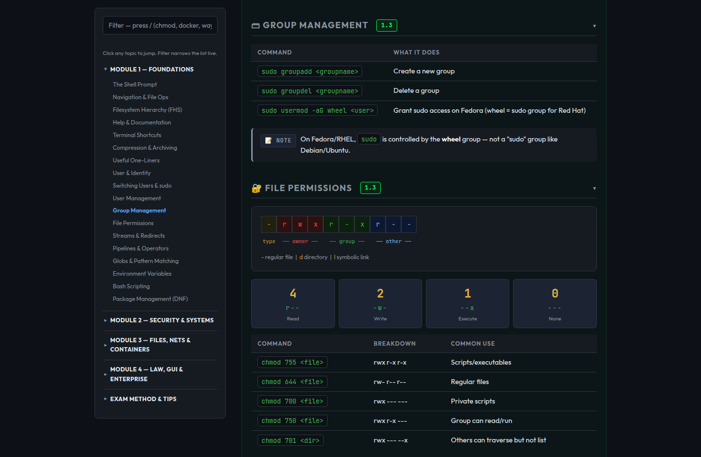

# Linux Fedora — Command Cheat Sheet

A single-file, fully offline, interactive cheat sheet for the Noroff **FI1AMLI75 — Linux** course (Fedora). One HTML file, zero dependencies, built to be open on a second screen while you work in the terminal.

**Open it here: [underknox.github.io/Fedoracheatsheet](https://underknox.github.io/Fedoracheatsheet/)** — or just download [`index.html`](index.html) and double-click it. It works identically without internet: the fonts, the styling, everything ships inside the one file.

## What it does

The sheet covers the whole course, module 1.1 through 4.4 — shell basics, navigation, FHS, users/groups/permissions, pipes and redirects, packages, SSH/GnuPG, systemd, cron, processes, filesystems, Vim, backup, networking, Docker, compiling from source, licensing/law, the graphical stack, mixed environments, and the Gentoo install — plus an exam section with a problem→tool reverse index, verification commands, classic traps, and a pre-exam checklist.

It is not a wall of text. Everything is built for speed of lookup:

Press `/` and type what you need — a command like `chmod` or a problem like "permission denied" — and every table row on the page filters live. Click any command to copy it to your clipboard (then paste in the terminal with `Ctrl+Shift+V` — plain `Ctrl+V` doesn't work there, which the sheet will also tell you). Type your own username into the field at the top and every example command on the page updates to match it. Section headings collapse and expand. The sidebar tracks where you are as you scroll. `Ctrl+P` produces a clean, toner-safe paper version.

## The fine print

Parts of this document are not documented. The document itself warns you about one thing, in more than one place, in small letters. People who ignore warnings tend to end up somewhere. That is all this README will say.

## Repository layout

`index.html` is the current version — the only file you need. `archive/` holds selected milestone versions showing how the sheet evolved (v2.5 the base, v2.8 the interactivity release, v2.9 the visual system, v2.10 the... see previous section). `CHANGELOG.md` has the full version history.

## Disclaimer

This is a student project. It is in no way affiliated with Noroff or its staff. Command explanations aim to be accurate for Fedora, and where the course material and reality disagree, the sheet says so — but verify anything critical with `man` pages, which is good practice anyway and the sheet's whole philosophy.

## Credits

Made by **Knox** ([@UnderKnox](https://github.com/UnderKnox)) — concept, direction, content decisions, testing, and taste. Coded together with **Claude** (Anthropic's AI) as pair-programmer across many sessions. Fonts: [Outfit](https://fonts.google.com/specimen/Outfit) and [JetBrains Mono](https://www.jetbrains.com/lp/mono/) (both OFL-licensed, embedded in the file).

Licensed under the [MIT License](LICENSE) — use it, share it, learn from it.
